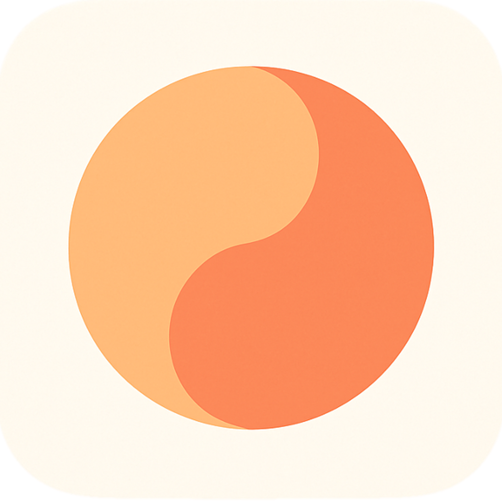

# Whole

<p align="center">
  
</p>

**Whole** is an iOS application designed to deliver bilingual (English and Chinese) quotes to your lock screen and standby mode, providing daily inspiration and motivation. The codebase and documentation emphasize clarity, maintainability, and a focus on core features for fast iteration and validation.

---

## Key Features

- **Bilingual Quotes:** Browse inspirational quotes in both English and Chinese with a simple, swipeable interface.
- **Widget Integration:** Displays the last viewed quote on your lock screen and in iOS Standby mode, keeping your inspiration fresh.
- **Favorites:** Like and save quotes to a dedicated Favorites tab, synced with your account via Supabase.
- **Quote Sharing:** Share any quote as a beautifully rendered image using the native iOS share sheet.
- **Theming:** Customize the look of quote cards and shared images with multiple themes, including Serene Minimalism and Elegant Monochrome.
- **Anonymous Accounts:** Enjoy full app functionality from the first launch. Your data is seamlessly migrated when you create an account.
- **Premium Subscription:** Unlock unlimited quotes, watermark-free sharing, premium themes, and the ability to create your own quotes.

---

## Major Updates & Milestones

- **Modern UI Overhauls:**
  - The **Paywall** has been redesigned with a professional, card-based layout to clearly communicate premium benefits.
  - The **Favorites** screen now features a clean, modern list of quote cards with an intuitive "Edit" mode for easy management.
- **Comprehensive Onboarding:** A multi-step onboarding flow guides new users through category selection, goal setting, and notification preferences.
- **Robust Backend Integration:**
  - Migrated all database identifiers to **UUIDs** for improved data consistency and type safety.
  - User data is synced in real-time with **Supabase**, including likes, preferences, and subscription status.
- **Enhanced Sharing:** Quote sharing is now more reliable and consistent, using the current theme's background color and enforcing watermark logic for non-premium users.

---

## Project Roadmap (Summary)

- **Step 1:** Data Models & ViewModels *(Complete)*
- **Step 2:** Backend Integration — Supabase *(Complete)*
- **Step 3:** Reusable UI Components *(Complete)*
- **Step 4:** Main Quote Browsing Interface *(Complete)*
- **Step 5:** Complete Settings Sections *(Complete)*
- **Step 6:** Sharing, Theming, and Paywall Polish *(Complete)*
- **Step 7:** Widget Development *(Complete)*
- **Step 8:** Onboarding Flow and Data Sync *(Complete)*
- **Step 9:** Paywall & Subscription Logic *(Complete)*
- **Step 10:** Favorites Feature *(Complete)*
- **Step 11:** User-Generated Quotes (Premium) *(Complete)*
- **Step 12:** Notifications & Analytics *(Complete)*
- **Step 13:** Theming & Styling *(Complete)*
- **Step 14:** Testing & Quality Assurance *(Todo)*
- **Step 15:** Final Review & Launch *(Todo)*
- **Ongoing/Future:** Advanced widget customization, additional sharing, and feature expansion based on user feedback. *(Planned)*

---

## Setup

1. **Clone the Repository**:
   ```bash
   git clone https://github.com/terrancehah/Whole.git
   ```

2. **Open the Project in Xcode**:
   ```bash
   open Whole.xcodeproj
   ```

3. **Install Dependencies**:
   - The project uses Swift Package Manager. Dependencies will be resolved automatically when you open the project.

4. **Configure Supabase**:
   - Create a Supabase project and obtain your API keys.
   - Add your keys to the `Supabase.swift` file in the project.

5. **Run the App**:
   - Launch the app on a simulator or physical device via Xcode.

---

## Development

- **Frontend:** Built with SwiftUI. Follow the guidelines in `frontend-guidelines.md` for consistent design.
- **Backend:** All backend operations are managed through `SupabaseService`. The app uses Supabase for authentication, database, and storage.
- **Architecture:** The app uses a clean, feature-based architecture with globally managed services for themes and data.

---

## Contributing
Please read the contribution guidelines before submitting pull requests.